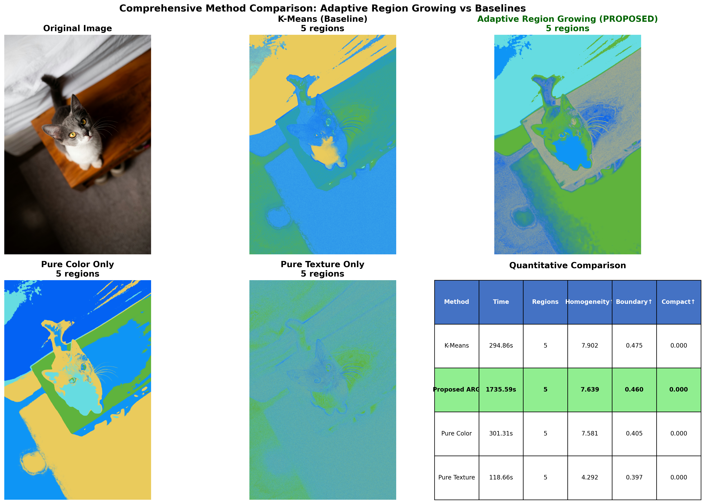
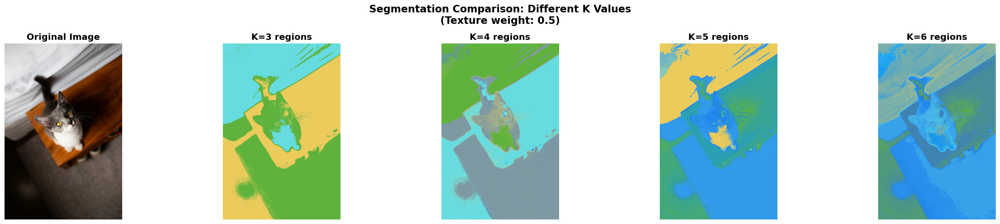
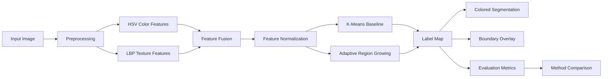

<div align="center">

# AdaptiveSeg

### Texture–Color Image Segmentation with Adaptive Region Growing

An unsupervised computer-vision project that combines **Local Binary Pattern (LBP) texture descriptors**, **HSV color features**, **K-Means clustering**, and a **custom adaptive region-growing pipeline** to study how texture, color, and spatial coherence affect image segmentation.


</div>

---

## Overview

Image segmentation divides an image into regions whose pixels share useful visual characteristics. Many simple approaches rely primarily on color, which can fail when two visually different surfaces have similar colors or when a single object contains substantial illumination variation.

**AdaptiveSeg** explores a lightweight, classical computer-vision alternative by combining:

- **Texture information** from Local Binary Patterns (LBP)
- **Color information** from the HSV color space
- **Feature-space clustering** using K-Means
- **Spatially coherent segmentation** using adaptive region growing
- **Parameter studies** over the number of segments and feature configurations
- **Quantitative comparison** using exploratory region-quality metrics

The project is designed as an **experimental segmentation framework**, not as a claim of state-of-the-art segmentation performance.

---

## Demo

### Method Comparison

The comparison pipeline evaluates the same image using K-Means, adaptive region growing, color-only features, and texture-only features.

<p align="center">
  
</p>

### Effect of the Number of Segments

The framework can sweep different values of **K** to visualize how segmentation granularity changes.

<p align="center">
  
</p>

### Segmentation Boundaries

<p align="center">
  
  
</p>

---

## Core Idea

AdaptiveSeg represents each image pixel with a compact texture–color feature vector:

\[
\mathbf{x}_i =
[
w_tT_i,\;
w_hH_i,\;
w_sS_i,\;
w_vV_i
]
\]

where:

- \(T_i\) is the normalized LBP texture value
- \(H_i\) is hue
- \(S_i\) is saturation
- \(V_i\) is brightness/value
- \(w_t, w_h, w_s, w_v\) control feature importance

The project then explores two main segmentation strategies:

1. **K-Means segmentation** — groups pixels in feature space without explicitly enforcing spatial connectivity.
2. **Adaptive region growing** — begins from automatically selected seeds and expands spatially connected regions according to local texture–color similarity.

---

## Pipeline



---

# Adaptive Region-Growing Method

The custom region-growing implementation adds spatial reasoning on top of the texture–color feature representation.

## 1. Local Texture Analysis

A local variance map is computed from the texture channel.

Low-variance areas are treated as comparatively homogeneous regions and become good candidates for seed initialization.

---

## 2. Spatially Distributed Seed Selection

The image is divided into a coarse spatial grid.

Within each grid cell, the algorithm selects a pixel with relatively low local texture variance.

This encourages seed coverage across different parts of the image rather than concentrating all seeds inside a single homogeneous region.

---

## 3. Region Growth

Each region expands through **4-connected neighboring pixels**:

```text
        Up
         ↑
Left ← Pixel → Right
         ↓
       Down
```

For each neighboring pixel, the algorithm computes its distance from the current region representation in the fused texture–color feature space.

---

## 4. Adaptive Similarity Threshold

Instead of using one fixed threshold everywhere, AdaptiveSeg adjusts the similarity threshold according to local texture complexity.

Conceptually:

```text
Smooth region
     ↓
Lower local variance
     ↓
Stricter similarity threshold
```

while:

```text
Highly textured region
        ↓
Higher local variance
        ↓
More permissive similarity threshold
```

This allows region growth to react differently to flat and highly textured parts of an image.

---

## 5. Remaining-Pixel Assignment

Some pixels may remain unassigned after the primary region-growing stage.

The implementation assigns remaining pixels based on the available region information so that the final segmentation map covers the complete image.

---

## 6. Region Refinement

Region-level processing can be applied after the initial growth stage to reduce small or fragmented areas and create a cleaner final segmentation.

---

# Feature Extraction

## HSV Color Features

The project converts each input image from BGR/RGB into **HSV color space**.

HSV separates:

| Channel | Meaning |
|---|---|
| H | Hue / color type |
| S | Saturation / color intensity |
| V | Brightness / value |

The channels are normalized before being used as machine-learning features.

---

## LBP Texture Features

Texture is represented using **Local Binary Patterns (LBP)**.

LBP analyzes the relationship between a pixel and its neighboring pixels to construct a local texture representation.

It is especially useful for distinguishing surfaces that may have similar colors but different visual patterns.

Examples include:

```text
Smooth wall
Wood grain
Fabric
Fur
Grass
Stone
Metal surfaces
```

---

# Feature Fusion

The project combines texture and color into one per-pixel representation:

```text
Pixel
 │
 ├── LBP Texture
 │
 ├── Hue
 │
 ├── Saturation
 │
 └── Value
        │
        ▼
[Texture, H, S, V]
```

Each image therefore becomes a feature matrix of approximately:

```text
Number of pixels × 4 features
```

Example:

```text
Image: 1000 × 800

Pixels:
800,000

Feature matrix:
800,000 × 4
```

This representation can then be used by K-Means or the adaptive region-growing algorithm.

---

# K-Means Baseline

K-Means provides a classical unsupervised baseline.

The algorithm groups pixel feature vectors into **K clusters** according to feature similarity.

Example:

```text
K = 3
```

creates three segmentation groups.

Increasing K generally creates more detailed segmentation:

```text
K = 3
↓
Broad regions

K = 5
↓
Moderate detail

K = 8
↓
Finer regions
```

However, K-Means works primarily in feature space and does not inherently require neighboring pixels to belong to the same cluster.

This motivates the spatial region-growing experiment.

---

# Features

AdaptiveSeg currently provides:

- **HSV color representation**
- **Uniform LBP texture descriptors**
- **Texture–color feature fusion**
- **Feature normalization**
- **K-Means segmentation baseline**
- **Custom adaptive region-growing implementation**
- **Automatic seed-point selection**
- **Local texture-variance analysis**
- **Adaptive similarity thresholds**
- **4-connected spatial region expansion**
- **Colored segmentation maps**
- **Segmentation boundary overlays**
- **K-value comparison experiments**
- **Color-only segmentation baseline**
- **Texture-only segmentation baseline**
- **Runtime measurement**
- **Exploratory segmentation-quality metrics**
- **Automatic result visualization**
- **Command-line experiment scripts**

---

# Evaluation

The comparison framework currently reports several **unsupervised / exploratory metrics**.

| Metric | Interpretation |
|---|---|
| Number of regions | Number of distinct output labels |
| Intra-region homogeneity | Measures feature consistency within individual regions |
| Boundary strength | Measures feature differences across neighboring region boundaries |
| Region compactness | Estimates geometric compactness of segmented regions |
| Computation time | Wall-clock runtime of each segmentation method |

These measurements make it possible to compare segmentation behavior beyond visual inspection.

> **Important:** These metrics are not replacements for standard ground-truth segmentation metrics such as mIoU, Dice/F1, Pixel Accuracy, or Boundary F1.

A future version of the project will evaluate against labeled segmentation datasets.

The objective of the current comparison is therefore to make algorithmic trade-offs **observable and measurable**, rather than claim universal superiority of any method.

---

# Method Comparison

The comparison framework evaluates four configurations:

| Method | Texture | Color | Spatial Connectivity |
|---|:---:|:---:|:---:|
| K-Means Fusion | ✓ | ✓ | ✗ |
| Adaptive Region Growing | ✓ | ✓ | ✓ |
| Color Only | ✗ | ✓ | ✗ |
| Texture Only | ✓ | ✗ | ✗ |

This helps isolate the contribution of:

- texture information
- color information
- texture–color fusion
- spatial reasoning

---

# Project Structure

```text
AdaptiveSeg/
│
├── adaptive_region_growing.py
│   └── Custom adaptive region-growing algorithm
│
├── compare_methods.py
│   └── Full comparison against baseline methods
│
├── compare_k_values.py
│   └── Compare segmentation using different K values
│
├── compare_texture_color.py
│   └── Explore different texture/color configurations
│
├── demo_adaptive_rg.py
│   └── Standalone adaptive region-growing experiment
│
├── requirements.txt
│   └── Python dependencies
│
├── src/
│   │
│   ├── __init__.py
│   │
│   ├── features.py
│   │   └── HSV + LBP feature extraction
│   │
│   ├── fusion.py
│   │   └── Feature fusion and weighting utilities
│   │
│   ├── segment_kmeans.py
│   │   └── K-Means segmentation pipeline
│   │
│   ├── visualize.py
│   │   └── Visualization, overlays, and result saving
│   │
│   └── main_demo.py
│       └── Main texture-color K-Means demo
│
└── data/
    │
    ├── input/
    │   └── Example input images
    │
    └── output/
        │
        ├── Segmentation results
        ├── Boundary overlays
        ├── K-value experiments
        │
        └── comparison/
            └── Cross-method comparison figures
```

Virtual environments, Python cache files, IDE metadata, temporary files, and machine-specific configuration should **not** be committed to the repository.

---

# Installation

## 1. Clone the Repository

```bash
git clone https://github.com/arrakib-cs/AdaptiveSeg.git
cd AdaptiveSeg
```

---

## 2. Create a Virtual Environment

### Windows PowerShell

```powershell
python -m venv .venv
```

Activate it:

```powershell
.\.venv\Scripts\Activate.ps1
```

### macOS / Linux

```bash
python3 -m venv .venv
```

Activate it:

```bash
source .venv/bin/activate
```

---

## 3. Install Dependencies

```bash
pip install --upgrade pip
```

Then:

```bash
pip install -r requirements.txt
```

---

# Dependencies

The current implementation uses:

```text
NumPy
OpenCV
Matplotlib
scikit-image
scikit-learn
```

The tested dependency versions are defined in:

```text
requirements.txt
```

---

# Quick Start

Run all commands from the root directory of the repository.

## Basic Texture–Color Segmentation

### Windows PowerShell

```powershell
python -m src.main_demo --input data/input/photo.jpg --output data/output --k 5 --texture_weight 0.5
```

### macOS / Linux

```bash
python -m src.main_demo \
    --input data/input/photo.jpg \
    --output data/output \
    --k 5 \
    --texture_weight 0.5
```

The pipeline will:

```text
Load image
   ↓
Extract HSV features
   ↓
Extract LBP texture
   ↓
Build feature matrix
   ↓
Normalize features
   ↓
Run K-Means
   ↓
Generate segmentation
   ↓
Generate boundary overlay
   ↓
Save results
```

---

# Visualize Extracted Features

To visualize the individual LBP and HSV feature channels:

```powershell
python -m src.main_demo --input data/input/photo.jpg --output data/output --k 5 --texture_weight 0.5 --show_features
```

This displays:

```text
LBP Texture
Hue
Saturation
Value / Brightness
```

This is useful for understanding what information the segmentation algorithm receives.

---

# Compare Different K Values

Run:

```powershell
python compare_k_values.py --input data/input/photo.jpg --k_values 3 4 5 6 --texture_weight 0.5 --save data/output/k_comparison.png
```

Example output:

<p align="center">
  
</p>

This experiment helps answer:

- How coarse should the segmentation be?
- How does segmentation change as K increases?
- When does segmentation begin to fragment meaningful regions?
- Which visual structures remain stable across different cluster counts?

---

# Compare Segmentation Methods

Run the complete comparison framework:

```powershell
python compare_methods.py --input data/input/photo.jpg --output data/output/comparison --k 5 --texture_weight 0.5
```

The script compares:

```text
K-Means
vs
Adaptive Region Growing
vs
Color Only
vs
Texture Only
```

It generates:

- segmentation maps
- visual method comparison
- segmentation-boundary comparison
- runtime measurements
- region statistics
- homogeneity measurements
- boundary-strength measurements

Example:

<p align="center">
  
</p>

---

# Texture–Color Feature Study

The project includes an experiment for exploring different texture/color settings.

```powershell
python compare_texture_color.py --input data/input/photo.jpg --k 5 --weights 0.0 0.3 0.5 0.7 1.0 --save data/output/texture_color_comparison.png
```

Conceptually:

```text
Texture weight = 0.0
→ Color only

Texture weight = 0.5
→ Balanced texture/color configuration

Texture weight = 1.0
→ Texture only
```

> For rigorous feature-weight ablation, feature normalization should preserve the intended relative feature weighting. The final experimental version should normalize the base channels first and then apply explicit feature weights before interpreting differences between non-zero weight settings.

---

# Example Output Files

Running the project can generate:

```text
data/output/
│
├── photo_segmented_k5.png
├── photo_overlay_k5.png
├── photo_comparison_k5.png
├── k_comparison.png
├── texture_color_comparison.png
│
└── comparison/
    ├── photo_full_comparison.png
    └── photo_detailed_comparison.png
```

The exact filenames depend on the selected input image and configuration.

---

# Design Decisions

## Why HSV Instead of Raw RGB?

RGB directly represents red, green, and blue intensities.

HSV separates visual information into:

```text
Hue
Saturation
Brightness
```

This makes HSV useful for experiments where color identity, color strength, and illumination should be represented separately.

---

## Why Local Binary Patterns?

Color alone cannot represent surface texture.

For example:

```text
Gray concrete
Gray fabric
Gray metal
```

may have similar average colors while having completely different surface structure.

LBP provides a compact representation of local texture patterns and complements HSV color information.

---

## Why K-Means?

K-Means provides a simple and reproducible baseline for clustering pixel-level feature vectors.

It makes it possible to study what the fused texture/color representation can achieve before adding spatial constraints.

---

## Why Region Growing?

Feature-space clustering does not inherently guarantee spatial coherence.

Two pixels can have similar features while being located on completely different sides of an image.

Region growing explicitly considers neighboring pixels.

This introduces:

```text
Feature similarity
+
Spatial connectivity
```

into the segmentation decision.

---

# Current Limitations

AdaptiveSeg is an experimental computer-vision prototype.

Several limitations remain.

## 1. CPU-Heavy Region Growing

The adaptive implementation performs Python-level neighborhood operations.

As a result, the region-growing method can be substantially slower than highly optimized or vectorized clustering methods on large images.

---

## 2. No Ground-Truth Benchmark Yet

Current evaluation uses exploratory unsupervised measurements rather than human-annotated segmentation masks.

A rigorous benchmark should evaluate against ground truth using metrics such as:

```text
mIoU
Dice / F1
Pixel Accuracy
Boundary F1
Precision
Recall
```

---

## 3. Parameter Sensitivity

Performance can depend on:

- number of target regions
- initial similarity threshold
- LBP configuration
- feature scaling
- texture/color weighting

---

## 4. Classical Features

LBP and HSV are lightweight and interpretable, but they do not capture high-level semantic meaning the way modern deep neural networks or foundation segmentation models do.

---

## 5. Runtime

The current implementation prioritizes algorithmic clarity rather than production-level speed.

This creates an opportunity for future systems optimization.

---

# Roadmap

## Algorithm & Evaluation

- [ ] Refactor feature scaling so normalization and weighting are mathematically consistent
- [ ] Add unit tests for feature extraction
- [ ] Add unit tests for feature fusion
- [ ] Add unit tests for segmentation utilities
- [ ] Benchmark using labeled segmentation datasets
- [ ] Add mIoU
- [ ] Add Dice/F1
- [ ] Add Pixel Accuracy
- [ ] Add Boundary F1
- [ ] Add Precision and Recall
- [ ] Add automated experiment logging

---

## Additional Baselines

Future comparisons can include:

- [ ] SLIC Superpixels
- [ ] Watershed
- [ ] Felzenszwalb graph segmentation
- [ ] Mean Shift
- [ ] DBSCAN
- [ ] Graph Cut
- [ ] Classical region growing
- [ ] DeepLab
- [ ] SAM-family segmentation models

The objective would not necessarily be to outperform every modern model, but to understand the trade-offs among:

```text
Accuracy
Interpretability
Compute cost
Memory
Latency
Training requirements
```

---

## Performance Engineering

The current Python implementation provides a useful reference implementation for future optimization.

Planned versions:

```text
V1
Pure Python Reference

       ↓

V2
Vectorized NumPy

       ↓

V3
Numba / Parallel CPU

       ↓

V4
C++ + OpenCV

       ↓

V5
CUDA / GPU
```

These implementations could be evaluated using:

- latency
- throughput
- CPU utilization
- GPU utilization
- peak memory
- segmentation quality
- speedup relative to the reference implementation

---

# Potential High-Performance Extension

A long-term direction for the project is to transform AdaptiveSeg into a small **computer-vision systems benchmark**.

Instead of evaluating only segmentation quality, future versions could evaluate the entire performance stack:

```text
Algorithm
   ↓
Implementation
   ↓
CPU/GPU execution
   ↓
Memory behavior
   ↓
Latency
   ↓
Throughput
   ↓
Quality / performance trade-off
```

For example:

| Implementation | Device | Latency | Speedup | Quality |
|---|---|---:|---:|---:|
| Python reference | CPU | TBD | 1× | TBD |
| NumPy | CPU | TBD | TBD | TBD |
| Numba | CPU | TBD | TBD | TBD |
| C++ | CPU | TBD | TBD | TBD |
| CUDA | GPU | TBD | TBD | TBD |

Actual values should be filled in only after reproducible benchmarking.

---

# Reproducibility

For reproducible experiments:

1. Use the dependency versions defined in `requirements.txt`.
2. Run experiments from the repository root.
3. Keep the same input image when comparing algorithms.
4. Keep the same target number of regions when comparing methods.
5. Record image resolution when reporting runtime.
6. Record CPU/GPU hardware when reporting performance.
7. Keep random seeds fixed where appropriate.
8. Preserve experimental configurations.

K-Means currently uses a fixed random state to improve repeatability.

---

# What This Project Demonstrates

From an engineering and computer-vision perspective, AdaptiveSeg demonstrates experience with:

### Computer Vision

- image processing
- color spaces
- feature extraction
- texture analysis
- image segmentation
- boundary visualization

### Machine Learning

- unsupervised learning
- clustering
- feature representations
- feature normalization
- parameter experiments

### Algorithms

- region growing
- neighborhood traversal
- seed selection
- adaptive thresholds
- spatial connectivity

### Research Engineering

- baseline comparison
- ablation-style experiments
- quantitative evaluation
- runtime measurement
- visualization
- experiment interpretation

### Software Engineering

- modular Python
- reusable feature pipelines
- CLI experiment scripts
- dependency management
- reproducible workflows

---

# Technologies

| Category | Technology |
|---|---|
| Programming Language | Python |
| Numerical Computing | NumPy |
| Computer Vision | OpenCV |
| Texture Extraction | scikit-image |
| Machine Learning | scikit-learn |
| Clustering | K-Means |
| Texture Descriptor | Local Binary Pattern |
| Color Representation | HSV |
| Visualization | Matplotlib |
| Experimentation | Custom Python pipelines |

---

# Possible Applications

Classical texture–color segmentation can be useful in domains where lightweight, interpretable segmentation is valuable.

Potential applications include:

- material segmentation
- surface inspection
- texture analysis
- agricultural imagery
- industrial inspection
- preprocessing for computer-vision pipelines
- medical-image experimentation
- robotics perception research
- image-region analysis
- educational computer-vision systems

The current project is a research/learning prototype and has not been validated for safety-critical or production applications.

---

# Future Research Questions

The project creates several interesting questions for further investigation:

### Feature Representation

Can richer texture descriptors improve region separation?

Possible alternatives:

```text
Gabor Filters
HOG
Wavelets
Learned CNN features
Vision Transformer features
```

### Adaptive Thresholding

Can the local threshold be learned automatically instead of manually defined?

### Seed Selection

Could seed initialization use:

```text
superpixels
saliency
edge density
uncertainty
learned features
```

instead of only local texture variance?

### Region Merging

Could region adjacency graphs provide more principled region-merging decisions?

### GPU Acceleration

How much of the region-growing process can be efficiently parallelized?

### Hybrid Classical + Deep Segmentation

Could classical texture information improve segmentation when combined with learned visual embeddings?

---

# Portfolio Positioning

AdaptiveSeg is best understood as an **algorithm-engineering and classical computer-vision project**.

The project demonstrates the ability to move beyond simply calling a pre-trained model by implementing and analyzing:

```text
Feature Extraction
       ↓
Representation
       ↓
Unsupervised Learning
       ↓
Custom Segmentation Algorithm
       ↓
Evaluation
       ↓
Visualization
       ↓
Performance Analysis
```

---

# Author

**Abdur Rahman Rakib**

Computer Science · Artificial Intelligence · Machine Learning · Computer Vision

GitHub: [@arrakib-cs](https://github.com/arrakib-cs)

---

# Acknowledgment

This project was developed as a computer-vision learning and experimentation project focused on understanding the interaction between:

**texture**, **color**, **clustering**, and **spatial coherence**

in unsupervised image segmentation.

If you find the project useful, feel free to explore the implementation, reproduce the experiments, or extend the framework.

---

<div align="center">

### AdaptiveSeg

**Exploring image segmentation from visual features to spatial structure.**

⭐ If you find this project useful, consider starring the repository.

</div>